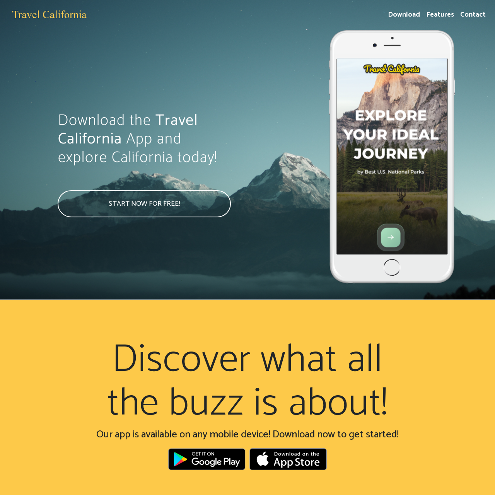

# Bootcamp Mini Project 3 - Travel California

## Description 

This project was created using HTML and CSS to make a web site to a wire frame without starting code. There was the following brief:

TRAVEL CALIFORNIA

Hello, we are Travel California and we need a website developer to bring our vision of our new webpage to life. Our in-house designer did a pretty good job, but feel free to tweak our design if you feel like you have ideas that can make us better. 

We like:
- Strong, legible fonts.
- Clear, well-defined sections.
- Lifestyle imagery that shows off the sights and scenery of California. The imagery must be crisp and make our viewers want to explore California.

Ways you can contribute:
- Many of our sections could use extra UI elements or features. Everything looks nice, but we wouldn’t mind more ways to interact with the webpage.
- Color scheme: If you want to explore another color palette, feel free! But try to stick to the style we have laid out in the design.
- Our typography looks nice, but we are always open to other suggestions. Maybe you can add a font that feels more... adventurous? 

The page in this repo is the result.

## Installation

The site does not require installation steps.

## Usage 

The website can be viewed at [https://bowseruk.github.io/travel-california/](https://bowseruk.github.io/travel-california/) with Google Chrome. The source can be viewed in Chrome by right clicking and selecting inspect.

## Credits

This site was based on a project by edX Boot Camps LLC.

[W3School](https://www.w3schools.com/) was used as a reference for elements to use and good practice.

The changes were checked with [W3C Validator](https://validator.w3.org/).

## License

This project uses the licence in the LICENCE file of the repo.